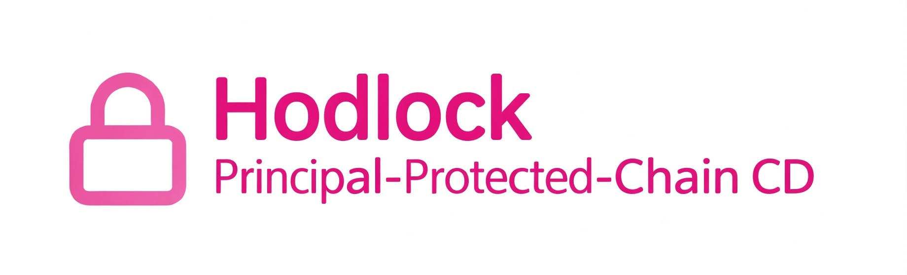

# Hodlock 🚀

[-3C3C3D.svg)](https://base.org)

**On-Chain CD with 100% Principal Protection**
**Lock tokens. Earn from early exits. Principal always safe.**

Hodlock is a revolutionary DeFi protocol that brings the safety of traditional Certificates of Deposit (CDs) to the blockchain — with real, sustainable yield.

Unlike risky yield farms or Ponzi-like schemes, Hodlock generates rewards **exclusively from early withdrawal penalties**. Diamond hands win big while paper hands fund the rewards. Your original deposit is **100% protected**, no matter what.

🔗 **Live App**: [https://hodlock.com](https://hodlock.com)  
Connect your wallet and start locking today!

## ✨ Why Hodlock is Different (And Better)

| Feature                        | Hodlock                              | Typical Yield Farm / Staking Pool |
|--------------------------------|--------------------------------------|-----------------------------------|
| **Principal Protection**       | 100% guaranteed                      | Often at risk / impermanent loss  |
| **Yield Source**               | Early withdrawal penalties only      | New deposits / inflation          |
| **Ponzi Risk**                 | None — zero reliance on new inflows  | High (depends on constant growth) |
| **Reward Mechanism**           | Paper hands pay → Diamond hands earn | Everyone diluted over time        |
| **Extra Perks**                | NFT certificates + lifetime referrals | Rarely                            |

- **True Principal Safety** – Your deposited tokens are always returned in full at maturity. Only early withdrawers pay penalties.
- **Sustainable Real Yield** – Rewards come solely from penalties, not new deposits or emissions.
- **Diamond Hands Rewarded** – The longer you hold, the more you earn from others who can't resist selling.
- **Soulbound NFT Certificates** – Each lock mints a unique NFT proving your diamond-hand status. Soulbound until maturity, transferable afterward.
- **Forever Referral Program** – Invite friends and earn **30% of their early withdrawal penalties — permanently**.

## 🚀 How It Works

1. **Connect Wallet** → Visit [hodlock.com](https://hodlock.com) and connect your wallet (Base chain).
2. **Choose Token & Lock** → Deposit supported tokens (e.g., weETH) for a fixed period (e.g., 365 days).
3. **Earn Rewards** → Early withdrawers pay penalties → those penalties are distributed to patient lockers like you.
4. **Withdraw at Maturity** → Get your full principal back + accumulated rewards.
5. **Early Exit?** → Possible, but you'll pay a penalty that goes straight to diamond hands.

It's that simple. No complex strategies, no impermanent loss, just pure HODL rewards.

## 💎 Referral Program – Earn Forever

Share your unique invite link and earn **30% commission on every early withdrawal penalty** from your referrals — **for life**.

No expiration. No limits. Build your passive income stream while helping friends discover real DeFi yield.

## 🛠 Built With

- **Smart Contracts**: Solidity (fully on-chain, transparent, and auditable)
- **Frontend**: TypeScript + modern React stack
- **Chain**: Base (Ethereum L2 – fast & cheap transactions)

Source code is fully open under AGPL-3.0 — fork, audit, or build on top of it!

## 👥 Community & Updates

Hodlock is growing fast. Join us and stay updated:

- 🌐 **Website**: [hodlock.com](https://hodlock.com)
- 🐦 **X/Twitter**: [@hodlockfi](https://x.com/hodlockfi) – Follow for announcements, updates, and alpha
- ⭐ Star this repo to show support
- Contribute code, ideas, or audits — PRs welcome!

## 📄 License

This project is licensed under the GNU AGPL v3.0 — see the [LICENSE](LICENSE) file for details.

---

**Hodlock: Where Diamond Hands Get Paid.**  
Lock once. Earn forever. Principal always safe.

Ready to HODL? → [hodlock.com](https://hodlock.com)
